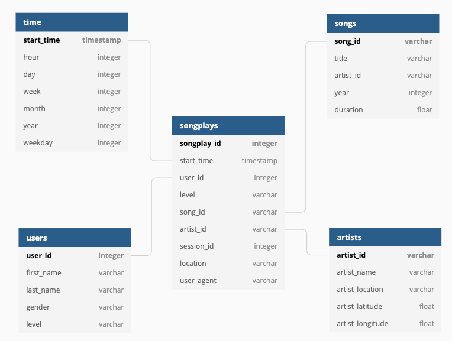

# Music Streaming: Data Warehouse with Redshift

A music streaming startup, Sparkify, has grown their user base and song database and wants to move their processes and data onto the cloud. Their data resides in S3, in a directory of JSON logs on user activity on the app, as well as a directory with JSON metadata on the songs in their app. The ETL pipeline extracts the data from S3, stages them in Redshift, and then transforms the data into a set of dimensional tables for the analytics team.

## Packages

This project primarily uses psycopg2 for working with Postgres.

## Motivation

The purpose of this database is to allow the analytics team to continue finding insights in what songs their users are listening to.

## Credit

This was part of Udacity's Data Engineering Nanodegree.

## Files

The three main files are:

- **sql_queries.py**, which contains the SQL queries responsible for dropping, creating, copying and inserting the JSON data
- **create_tables.py**, which wraps the drop and create statements into functions
- **etl.py**, which wraps the copy and insert statements into functions

To run the ETL pipeline, first start up your Redshift cluster. Then, you'll want to execute `python create_tables.py` in the terminal. This drops tables if they exist and then creates new tables with the appropriate columns. Finally, you'll run `python etl.py` to process and insert the log data into the tables.

## Results

1. Database schema design and ETL pipeline:
    - We used the star schema with one fact table (songplays) and several dimension tables (songs, artists, time and users) in order to provide the anlytics team with an efficient relational database setup for their queries. With the star schema, users will be able to use simplified queries and have fast aggregations. The ETL pipeline stages the JSON data from S3 into Redshift, then filters the log data to records associated with song plays, and then inserts the data into Redshift tables.
