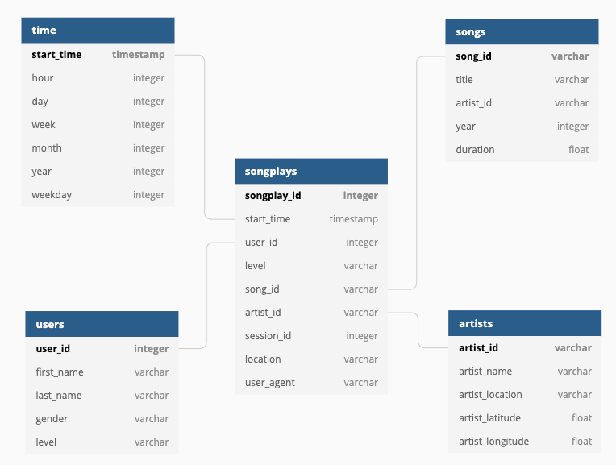

# Music Streaming: Data Lake with Spark

A music streaming startup, Sparkify, has grown their user base and song database even more and want to move their data warehouse to a data lake. Their data resides in S3, in a directory of JSON logs on user activity on the app, as well as a directory with JSON metadata on the songs in their app.

In this project, we'll build an ETL pipeline for a data lake hosted on S3. We will start by loading data from S3, processing the data into analytics tables using Spark, and loading them back into S3. We'll deploy this Spark process on a cluster using AWS.

## Packages

This project primarily uses pyspark packages for working with Spark.

## Motivation

The purpose of this database is to allow the analytics team to continue finding insights in what songs their users are listening to.

## Credit

This was part of Udacity's Data Engineering Nanodegree.

## Files

The main file is **etl.py**, which creates the tables using Spark and writes them to S3.

To run the ETL pipeline, you'll want to execute `python etl.py` in the terminal.

## Results

- Database schema design
    - We used the star schema with one fact table (songplays) and several dimension tables (songs, artists, time and users) in order to provide the analytics team with an efficient relational database setup for their queries. With the star schema, users will be able to use simplified queries and have fast aggregations.
